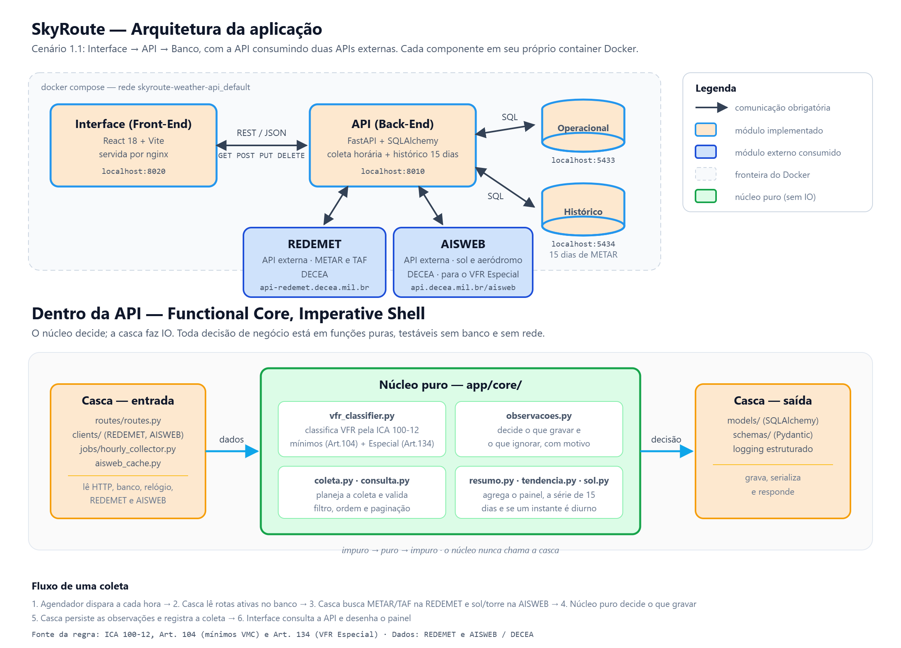

# SkyRoute — API (Back-end)

API do **SkyRoute**, sistema de acompanhamento meteorológico para aviação. A pergunta que o sistema responde é simples: **As condições nos aeródromos desta rota estão dentro dos mínimos para voo VFR (Regra de Voo Visual)?** 
Ela coleta mensagens **METAR (Observação)** e **TAF (Previsão)** da [REDEMET](https://api-redemet.decea.mil.br) (DECEA), que é a fonte oficial da autoridade aeronáutica brasileira, para os aeródromos de origem e destino de cada rota cadastrada, classifica a condição operacional segundo os mínimos VMC da **ICA 100-12 (Art. 104, Tabela 1)** e entrega o resultado para a interface.
Além disso, opcionalmente, existe uma segunda coleta em outra API externa, mas sem ela o app roda normal, porém, fica comprometida a classificação de eventual status VFR Especial de um aeroporto. Para essa situação, automaticamente, como regra de negócio, é feito o enquadramento de acordo com as regras do **ICA 100-12 (Art. 104, Tabela 1)** em "abaixo dos mínimos", que é o padrão conservador.
Cadastro da [AISWEB](https://aisweb.decea.mil.br/?i=publicacoes&p=api) (DECEA), faz a coleta dos dados necessários, de cada aeroporto individualmente e especificamente demandado na rota, para validação de condições especiais.

> Este repositório contém a **API**. A interface (React) está em
> **[MVP-IV-Front-end](https://github.com/digofd/MVP-IV-Front-end)**.



---

## Sumário

- [Arquitetura](#arquitetura)
- [Instalação e execução](#instalação-e-execução)
- [Endpoints da API](#endpoints-da-api)
- [Funcionalidades além do CRUD](#funcionalidades-além-do-crud)
- [Testes](#testes)
- [Manutenção de dados](#manutenção-de-dados)
- [Estrutura do repositório](#estrutura-do-repositório)
- [Decisões de projeto](#decisões-de-projeto)

---

## Arquitetura

Segue o **Cenário 1.1** como base mínima exigida no MVP: interface → API → banco, com a API consumindo uma API externa.
Cada componente roda em seu próprio container, e cada um dos dois componentes implementados tem seu próprio repositório.

| Componente | Tecnologia | Porta no host | Repositório |
|---|---|---|---|
| **Interface** | React 18 + Vite, servida por nginx | `8020` | [MVP-IV-Front-end](https://github.com/digofd/MVP-IV-Front-end) |
| **API** | FastAPI + SQLAlchemy assíncrono + APScheduler | `8010` | este |
| **Banco operacional** | PostgreSQL 14 | `5433` | este |
| **Banco de histórico** | PostgreSQL 14 — 15 dias de série | `5434` | este |
| **API Externa** | REDEMET / DECEA | — | consumido pela API |
| **API Externa** | AISWEB / DECEA | — | consumido pela API |

### Estratégias de comunicação

- **Interface → API:** REST com JSON sobre HTTP (`GET`, `POST`, `PUT`, `DELETE`). O navegador do usuário chama e a API libera **CORS** 
para a origem da interface.
- **API REDEMET:** HTTPS com JSON, a chave vai como parâmetro `api_key`.
- **API AISWEB:** HTTPS com resposta em XML (`apiKey`/`apiPass`), e as Cartas de Área chegam em PDF.
- **API dos bancos:** SQL pelo driver assíncrono `asyncpg`, dentro da rede do Docker Compose (`db:5432` e `db_historico:5432`).
- **Coleta agendada:** o APScheduler, dentro da própria API, busca METAR e TAF de hora em hora, sem depender de a interface estar aberta.

O histórico fica em **instância separada** de propósito, pois os 15 dias de METAR e SPECI, a cada 2h de todos os
aeródromos monitorados, não podem disputar CPU e armazenamento com a coleta operacional, por isso a retenção das
duas bases é independente, com finalidades distintas.

> As portas 8000 e 5432 costumam estar ocupadas por outros projetos na minha máquina, por isso a publicação usa 8010, 5433 e 5434. 
Dentro da rede do Docker Compose os serviços continuam se falando por `db:5432` e `api:8000`.

### Por dentro da API

Após a aula do Professor Otávio Lemos, no dia 25/08/2026, com a apresentação do vídeo do youtube
"Moving IO to the edges of your app: Functional Core, Imperative Shell - Scott Wlaschin",
achei espetacular e resolvi me aprofundar no tema Núcleo Funcional e Casca Imperativa.
Desta forma, desenvolvi meu Projeto de MVP - Skyroute, com a API organizada em **Functional Core, Imperative Shell**: 
onde toda decisão de negócio mora em funções puras, e todo IO nas bordas, com testes de unidade para as regras de negócio, 
sem mistura-las com as entradas e saídas. Ou seja:

- **`app/core/`** — núcleo funcional puro com as regras de negócio. Sem banco, sem rede, sem relógio, sem log.
  Classifica VFR, VFR Especial, IFR ou Indeterminado, decide o que gravar, planeja a coleta, valida filtros e 
  agrega o painel.
- **`app/clients/`, `app/jobs/`, `app/routes/`, `app/models/`** — a casca, onde busca, grava,
  serializa e responde, sem tomar decisões do negócio. Dois clientes externos: REDEMET(METAR/TAF) e 
  AISWEB — DECEA (com nascer/pôr do sol e dados de aeródromo, para classificar quando VFR Especial).

Um teste de arquitetura (`tests/test_arquitetura.py`) reprova o build se o núcleo importar infraestrutura ou 
ler o relógio, a regra é verificada, não apenas documentada.

---

## Instalação e execução

### Pré-requisitos

- **Docker Desktop** com Docker Compose v2
- Uma **chave da API REDEMET** — cadastro gratuito em <https://redemet.decea.mil.br>
- Uma **chave da API AISWEB** — cadastro gratuito em <https://aisweb.decea.mil.br/?i=publicacoes&p=api>
- Para desenvolvimento fora do container: **Python 3.11+**

### 1. Configurar o ambiente

Copie o modelo e preencha os valores:

```bash
git clone https://github.com/digofd/MVP-IV-Back-end.git
cd MVP-IV-Back-end
cp .env.example .env
```

O arquivo `.env` precisa conter:

```ini
DATABASE_URL=postgresql+asyncpg://usuario:suasenha@db:5432/skyroute
HISTORICO_DATABASE_URL=postgresql+asyncpg://usuario:suasenha@db_historico:5432/skyroute_historico
HISTORICO_DIAS=15
REDEMET_BASE_URL=https://api-redemet.decea.mil.br
REDEMET_API_KEY=sua_chave_aqui
POSTGRES_USER=usuario
POSTGRES_PASSWORD=suasenha
POSTGRES_DB=skyroute
POSTGRES_HISTORICO_DB=skyroute_historico
DB_ECHO=false
COLLECTOR_INTERVAL_MINUTES=60
AISWEB_BASE_URL=https://api.decea.mil.br/aisweb/
AISWEB_API_KEY=sua_chave_aqui
AISWEB_API_PASS=seu_pass_aqui
```

> `HISTORICO_DATABASE_URL` e `POSTGRES_HISTORICO_DB` são obrigatórias: sem elas a API não sobe
> e o container `db_historico` não cria o banco.

> **Não versione o arquivo `.env`!!!** 
> As chaves da REDEMET e da AISWEB trafegam como parâmetro de URL, a aplicação já suprime o log 
> das URLs de requisição para não gravá-las em texto claro e o `.dockerignore` impede que o `.env` entre na imagem.

### 2. Subir a API

```bash
docker compose up -d --build
```

> Isso levanta os três containers deste repositório na ordem correta (API, banco operacional e banco
> de histórico) — os dois bancos têm *healthcheck*, e a API só inicia quando ambos respondem.

| Serviço | URL |
|---|---|
| API (documentação interativa — Swagger) | <http://localhost:8010/docs> |
| API (status) | <http://localhost:8010/health> |

Para ver a aplicação completa, suba em seguida a interface do repositório
[MVP-IV-Front-end](https://github.com/digofd/MVP-IV-Front-end), que abre em <http://localhost:8020>.

### 3. Verificar

```bash
curl http://localhost:8010/health
docker compose ps
docker compose logs -f api
```

### Desenvolvimento local (sem container)

```bash
python -m venv venv
# Windows
venv\Scripts\activate
# Linux/macOS usar: source venv/bin/activate
pip install -r requirements.txt
uvicorn app.main:app --reload --port 8000
```

Fora do container os hosts `db` e `db_historico` não existem: no `.env`, troque-os por
`localhost:5433` e `localhost:5434`, com os bancos do Docker Compose.

### Parar

```bash
docker compose down             # mantém os dados
# OU
docker compose down -v          # apaga os volumes, zera tudo
```

---

## Endpoints da API

| Método | Rota | O que faz |
|---|---|---|
| `GET` | `/health` | Verifica a prontidão da API e do banco |
| `GET` | `/routes` | Lista rotas — com filtro, ordenação e paginação |
| `GET` | `/routes/{id}` | Uma rota com as observações mais recentes (até 20) |
| `GET` | `/routes/{id}/observacoes` | METAR e TAF da rota numa janela de horas (24h por padrão), paginados |
| `GET` | `/routes/{id}/resumo` | Resumo agregado para o painel |
| `POST` | `/routes` | Cria a rota, coleta na hora e dispara em segundo plano o histórico de 15 dias e a detecção da classe de espaço aéreo de ICAO |
| `PUT` | `/routes/{id}` | Ativa ou desativa a rota na coleta horária |
| `DELETE` | `/routes/{id}` | Remove a rota e em cascata suas observações |
| `GET` | `/historico/{icao}` | Série de 15 dias de observações METAR de um aeródromo, com resumo por dia |
| `GET` | `/historico/rota/{id}` | Série dos dois aeródromos da rota, lado a lado |
| `POST` | `/historico/coletar` | Preenche os 15 dias de observações METAR e expurga o excedente (`?dias=1` para uma janela menor) |

### Exemplos

```bash
# Criar uma rota (o ICAO é normalizado para 4 letras maiúsculas dos aeródromos. A origem e o destino precisam ser diferentes!)
curl -X POST http://localhost:8010/routes \
  -H "Content-Type: application/json" \
  -d '{"origem_icao":"SBSP","destino_icao":"SBGL"}'

# Listar apenas rotas ativas que passam por SBSP, ordenadas por origem
curl "http://localhost:8010/routes?ativa=true&icao=SBSP&ordenar_por=origem_icao&ordem=asc&pagina=1&tamanho=10"

# Desativar uma rota
curl -X PUT http://localhost:8010/routes/1 \
  -H "Content-Type: application/json" -d '{"ativa":false}'

# Excluir
curl -X DELETE http://localhost:8010/routes/1
```

---

## Funcionalidades além do CRUD

- **Coleta agendada** — APScheduler executa a coleta de todas as rotas ativas a cada hora,
  e uma vez na subida da aplicação.
- **Coleta sob demanda** — ao criar uma rota já dispara a busca de METAR e TAF, de modo que a
  resposta do `POST` volta com as primeiras observações.
- **Paginação** — `pagina` e `tamanho` (máximo de 100 itens), com envelope contendo
  `total`, `pagina`, `tamanho` e `paginas`.
- **Filtros** — por situação (`ativa`) e por código ICAO, casando com a origem **ou** destino.
- **Ordenação** — por `criado_em`, `origem_icao`, `destino_icao` ou `id`, ascendente ou
  descendente. Campo fora da lista devolve **422** com a lista de valores aceitos.
- **Validação na borda** — ICAO com 4 caracteres alfanuméricos, e origem diferente do destino,
  e entrada inválida devolve **422** com o valor recusado.
- **Resumo agregado** — `/routes/{id}/resumo` devolve contagem por condição, total de
  METAR e TAF, condição atual e data da última leitura.
- **Registro de coleta** — cada execução grava em `collection_logs` se houve sucesso e,
  quando não houve, **qual** foi a falha: HTTP com status, falha de rede, ou ausência
  legítima de mensagens.
- **Classificação com base legal** — cada observação guarda a condição e o dispositivo
  normativo legal do DECEA que a sustenta.
- **Prontidão** — `/health` verifica o banco, e é usado pelo painel para mostrar o
  estado da conexão.
- **Logs com contexto** — os campos de cada evento (quantos alvos, quantas leituras gravadas,
  falhas) saem em JSON no fim da linha do log.
- **Histórico preenchido ao criar a rota** — os 15 dias começam a serem buscados em segundo
  plano assim que a rota é criada, sem travar a resposta do `POST`. Aeródromo que for repetido, já 
  existente em outra rota é pulado, evitando requisições de dados à toa, que já possuímos, a API REDEMET.

### Histórico e tendências — 15 dias de observações METAR de um aeródromo

Módulo com banco próprio, para responder não só **como está** mas **como chegou até aqui**.

- **Cobertura de 15 dias de observações METAR de um aeródromo**: 14 passados mais o dia corrente,
  que é atualizado de hora em hora.
- **Preenchimento retroativo sem histórico gravado** em janelas de 2 horas com os aeródromos agrupados
  numa requisição, pois a API REDEMET aceita lista `SBSP,SBGL,...` e devolve tudo o que houver no intervalo.
  São 12 requisições feitas por dia no total, não por aeródromo, reduzindo o número de pedidos.
- **SPECI é ponto extra, não substituto.** Ele é emitido justamente quando a condição meteoro muda de forma
  significativa. O pior teto do dia costuma estar em um deles além da quantidade de emissões extraordinárias, 
  por exemplo, em um dia de meteorologia instável foram medidos 31 SPECI contra 24 METAR.
- **Série por aeródromo** e não por rota: o mesmo SBSP em duas rotas é coletado e guardado apenas uma vez.
- **Retenção automática**: o que passa de 14 dias é expurgado a cada execução horária.
- **Recuperação de lacunas na subida**: se a aplicação ficou fora do ar (máquina desligada, por
  exemplo), ao subir ela confere a leitura mais nova de cada aeródromo e recoleta, em segundo plano,
  os dias que ficaram sem dados. A tarefa horária sozinha só cobre as últimas 2 horas.
- **Quatro variações por dia** — teto, visibilidade, temperatura do ar e pressão (QNH), cada uma com
  mínimo, máximo, média e amplitude, mais as horas em cada condição e o instante em que o dia
  apertou.
- **VFR Especial (ICA 100-12, Art. 134)** — teto ≥ 1.000 ft e visibilidade ≥ 3.000 m (abaixo do
  mínimo do VFR normal, mas ainda dentro do Especial), com período diurno e aeródromo dentro de
  CTR/ATZ **confirmados de verdade na AISWEB**: nascer/pôr do sol e presença de torre vêm da API AISWEB,
  com os dados reais e atualizados coletados da API, não por aproximação de regras fixas de tabela.
  Quando um dos dois não pode ser confirmado, por exemplo AISWEB fora do ar, a leitura cai em **IFR**,
  nunca em VFR Especial por suposição. O app é informativo, não autoritativo, tendo em vista que uma  
  classificação de falso VFR Especial, sem respeitar todas as condições, pode custar vidas humanas e material, 
  por isso, **um falso Especial é mais caro que um falso IFR**, e a regra de negócio é conservadora.

---

## Testes

```bash
venv\Scripts\python.exe -m pytest
# ou, com a API de pé: docker compose exec api python -m pytest
```

**187 testes, cerca de 3 segundos, sem banco e sem rede**: o núcleo é só função pura, e as
duas cascas de cliente HTTP testadas (REDEMET, AISWEB) usam `httpx.MockTransport`, não um
servidor de verdade.

| Arquivo | Cobre |
|---|---|
| `tests/core/test_vfr_classifier.py` | tabela de casos da regra VFR, VFR Especial (Art. 134), Classe B (8 km) |
| `tests/core/test_espaco_aereo.py` | classe real por ICAO (manual + detectada), fallback G, leitura da Carta de Área |
| `tests/core/test_observacoes.py` | decisão do que gravar e do que ignorar |
| `tests/core/test_coleta.py` | janela de coleta e alvos, sem duplicar pares, e quantos dias recuperar após a aplicação ficar fora do ar |
| `tests/core/test_consulta_e_resumo.py` | paginação, ordenação, filtros e agregação |
| `tests/core/test_tendencia.py` | série diária do histórico, variação e contagem por status |
| `tests/parsers/test_parsers.py` | METAR e TAF com mensagens reais da REDEMET |
| `tests/clients/test_redemet_client.py` | tradução de falha HTTP, falha de rede e redação da chave |
| `tests/clients/test_aisweb_client.py` | idem, mais a lista de cartas (`area=cartas`) e o download do PDF |
| `tests/routes/test_historico_coletar.py` | `POST /historico/coletar?dias=N` coleta N dias sem encurtar a retenção de 15 dias |
| `tests/schemas/test_route_schema.py` | normalização do ICAO e recusa de origem igual ao destino |
| `tests/test_cache_aisweb.py` | gravação do texto da carta resolve conflito em vez de estourar, quando origem e destino baixam a mesma carta |
| `tests/test_logging_config.py` | campos `extra` do log chegam à saída, como JSON |
| `tests/test_arquitetura.py` | o núcleo não importa infraestrutura nem lê o relógio |

---

## Manutenção de dados

Se a regra de classificação mudar, as observações já gravadas podem ser recalculadas a
partir da mensagem bruta (raw), que é sempre preservada:

```bash
docker compose exec api python scripts/reclassificar_observacoes.py            # simula
docker compose exec api python scripts/reclassificar_observacoes.py --aplicar  # grava
```

A simulação mostra quantas linhas mudariam e quais transições de status ocorreriam, antes
de qualquer escrita.

---

## Estrutura do repositório

```
MVP-IV-Back-end/
├── docs/
│   └── arquitetura.svg / .png      fluxograma da arquitetura
├── Dockerfile
├── .dockerignore                   mantém .env e venv fora da imagem
├── docker-compose.yml              orquestra api + db + db_historico
├── .env.example                    modelo das variáveis de ambiente
├── pytest.ini
├── requirements.txt
├── app/
│   ├── core/                       NÚCLEO PURO — nenhuma dependência de IO
│   │   ├── vfr_classifier.py       classificação VFR (ICA 100-12 e VFR Especial, Art. 134)
│   │   ├── espaco_aereo.py         classe real de espaço aéreo por ICAO, com fonte e fallback G
│   │   ├── observacoes.py          decide o que gravar e o que ignorar
│   │   ├── coleta.py               janela e alvos da coleta, e dias a recuperar
│   │   ├── consulta.py             paginação, ordenação e filtros
│   │   ├── resumo.py               agregação do painel
│   │   ├── sol.py                  se um instante é diurno, dado nascer/pôr do sol já buscado
│   │   └── tendencia.py            série e resumo diário do histórico
│   ├── clients/                    clientes da REDEMET e da AISWEB (DECEA)
│   ├── jobs/                       coletor horário
│   ├── historico/                  coletor e modelo do banco de 15 dias
│   ├── models/                     mapeamento ORM (rotas, observações, cache da AISWEB)
│   ├── parsers/                    METAR e TAF (puros)
│   ├── routes/                     endpoints HTTP
│   ├── schemas/                    DTOs de fronteira
│   ├── aisweb_cache.py             casca: nascer/pôr do sol, presença de torre e edição das cartas
│   ├── deteccao_classe_espaco_aereo.py  casca: baixa e lê carta pra detectar classe de ICAO novo
│   ├── config.py                   configuração
│   ├── logging_config.py           formato do log, com os campos extras em JSON
│   ├── database.py                 motor e sessão
│   └── main.py                     raiz de composição
├── scripts/                        manutenção de dados
└── tests/
```

---

## Decisões de projeto

**Mínimos VMC.** A visibilidade de 5 km e a distância vertical de nuvens de 300 m
(1.000 pés) vêm da ICA 100-12, Art. 104, Tabela 1, faixa de aeródromo. O METAR informa
teto, não distância a nuvens, então o teto é usado como proxy do afastamento vertical, e
a limitação está documentada no próprio módulo.

**Classes F e G.** A Tabela 1 prevê, para essas classes na faixa baixa, o critério "livre
de nuvens e avistando o solo", que não se expressa como número. O sistema aplica o limiar
numérico a todas as classes, o que é **mais restritivo** para F e G.

**Classe de espaço aéreo real por aeródromo, não mais G fixo.**
A AISWEB não expõe classe de espaço aéreo em campo de API (testado em `area=rotaer` e
`area=sol`), e a VAC do aeródromo só às vezes traz o bloco de classe. A fonte que serve é 
a **Carta de Área (ARC)**, `area=cartas&tipo=ARC`: são 20 cartas cobrindo todo o país, e 
cada uma traz a tabela de espaços aéreos da região (CTR, ATZ, TMA, CTA) com nome, classe e 
limites verticais, em texto extraível do PDF.
`app/core/espaco_aereo.py` guarda `CLASSES_CONHECIDAS`, uma tabela estática por código ICAO
checado (carta, edição, data), caso esteja vencida ou sem informação, classifica com a forma 
mais conservadora. O Aeródromo fora dela é coberto por `app/deteccao_classe_espaco_aereo.py`: 
o ROTAER dá o nome e a cidade do aeródromo, as Cartas de Área são varridas atrás desse nome e 
a classe é a âncora "`<letra>` GND/SFC" mais próxima. Exigir GND/SFC é o que separa o tipo de órgão
de CTR/ATZ do aeródromo, que sempre começa no controle de solo, das terminais TMA/CTA vizinhas na tabela. 
Cartas diferentes, que cobrem a mesma região servem de conferência cruzada, e o texto das 20 cartas 
fica em cache (`carta_texto`), então os ~80 MB são baixados uma vez, não por aeródromo. 
Medidos para teste em 08/09/2026: SBGL=D, SBFL=D, SBSV=C, SBPA=C, SBVT=C — SBES (as
cartas discordam entre ALDEIA 1 e 2) e SBME (sem nome no ROTAER), seguem no fallback.
Aeródromo sem classe manual ou nãqo detectada cai no fallback G, que nunca é mais permissivo,
porque G tem os mesmos mínimos numéricos de C/D neste classificador, e o hover do mouse mostra
"(classe não verificada)" em vez de citar uma classe como se fosse dado conferido.
Uma tarefa semanal (`_verificar_edicao_das_classes` em `app/main.py`) compara o AMDT atual da
carta-fonte de cada ICAO com o último visto, gravado em `carta_amdt_vista`, e só *avisa* no log quando muda, 
pois essa tabela não se atualiza sozinha, diferente da detectada automaticamente, que já se resolve a cada rota.
O caso de F/G acima já era conservador naturalmente por design na tabela estática.

**TAF usa a previsão operativa no recebimento.** O TAF é uma linha do tempo, não uma foto: 
BASE geral de dados vale até o primeiro BECMG, quando quando sua janela temporal já começou. 
O BECMG representa mudança permanente, então a condição nova substitui BASE dali em diante, 
mesmo depois da própria janela do BECMG terminar. 
Já os TEMPO e PROB nunca definem o status principal, porque descrevem condição temporária e 
quando um dos dois está em vigor no recebimento, vira um aviso ao lado do selo com ícone ⚠, 
com o texto do período, sem mudar a classificação geral (VFR, IFR, etc).

**A condição atual vem só do METAR.** TAF é previsão, e previsão não descreve a condição
de agora.

**Coleta síncrona na criação da rota.** O `POST` espera a coleta para já devolver as
observações. Se a coleta falhar, a rota criada é devolvida mesmo assim, e a falha vai para
o log e para a tabela de coleta, pois perder a resposta deixaria o usuário sem saber que a
rota existe.

**Reinício do container não duplica observação.** A coleta imediata roda a cada subida,
além da hora fechada normal. A tabela `observations` tem uma `UNIQUE` na chave natural
(rota + aeródromo + tipo + mensagem + recebimento, espelhando `uq_leitura_historica`
do banco de histórico) e a gravação usa `INSERT ... ON CONFLICT DO NOTHING`, executa a mesma
coleta, mas não duplica.

**VFR Especial sem confirmação vira "abaixo dos mínimos", nunca uma suposição.** O núcleo
recebe `diurno` e `dentro_ctr_atz` já prontos, e quem resolve isso é a casca, consultando a
AISWEB (nascer/pôr do sol, presença de CTR/ATZ, já que a API não expõe a geometria da zona diretamente). 
Quando um dos dois vem `None` (AISWEB fora do ar) ou `False`, a leitura cai no lado conservador. 

**Histórico da rota nova em segundo plano, não no `POST`.** Diferente da coleta
operacional que tem uma chamada com resposta em milissegundos, preencher os 15 dias leva alguns segundos, 
e esperar isso na resposta do `POST` deixaria a criação lenta e possibilita timeout. Assim, a interface 
mostra uma barra dinâmica de progresso que atualiza sozinha quando os dados chegam.

---

## Créditos e fontes

- **Dados meteorológicos:** REDEMET — Departamento de Controle do Espaço Aéreo (DECEA).
- **Nascer/pôr do sol e dados de aeródromo:** API AISWEB (DECEA).
- **Regra operacional:** ICA 100-12 — *Regras do Ar*, Art. 104 (Tabela 1, mínimos VMC) e
  Art. 134 (VFR Especial).
- **Arquitetura Functional Core, Imperative Shell:** baseada na teoria e fundamentos de Scott Wlaschin no livro 
  *Domain Modeling Made Functional* e Mark Seemann no livro *Code That Fits in Your Head*.

# Desenvolvedor do Projeto

<br><sub>Rodrigo Domingues</sub> 
(https://github.com/digofd)
